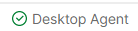

# DSGT Member Portal
## Description
 The membership portal for Data Science at Georgia Tech (DSGT), started in 2022. The portal is used to manage the members in the club and comes with many features such as a registration form, stripe payment verification webhook, member management, SMTP email sending, event check-ins, and more!
## Authors
This portal was made by [@JohnRamberger in 2022](https://github.com/JohnRamberger) and [@VicenteMiranda in 2023](https://github.com/vicente6j) and is maintained/updated by the DSGT Technology Team. 

Interested in joining the Tech Team? Reach out to [Vicente](mailto:vmiranda6@gatech.edu)

## Frameworks
Frontend: React.js written in Typescript, SASS.
Backend: Express.js written in Typescript, data using PostgreSQL and Knex.js.
Hosted on Heroku.

## Api Documentation
- Production: https://member.datasciencegt.org/docs
- Development (might need  to change port): http://localhost:3000/docs

# Quick Start (Already Setup)
Note that you should always verify an instance of Postgres is running (otherwise npm run dev will throw ECONREFUSED even if it looks like things are running properly). If Postgres isn't in the background, you'll just see the letters D-S-G-T upon starting with `npm run start`.
1. Open 2 consoles in the root folder
2. Run `npm run dev` in console 1.
    - This will install any new dependencies and start the backend.
3. Run `cd client && npm run start`.
    - This will navigate to the client, install any new dependencies, and start the frontend.

If you only want the backend, only start the backend. 
If you only want the frontend, only start the frontend (but 99% of the frontend requires the backed).

## Making an Account
When booting up the portal locally for the first time, you may notice that you don't have a way to log in (The data on the production server is not the same as the data on your local server). Since we require all members to have paid their dues, we get account info from Stripe. To bypass this, you can simulate a Stripe payment through Postman. 

1. Make sure you seed your database using `npx knex seed:run`. This will bypass the stripe payment for `test@test.com`.
2. Next, on the login page click the `Register` button, then hit `Already Paid? Continue Registration`. Enter `test@test.com` and create your account.
3. Run the seed command (`npx knex seed:run`) again in order to gain full access to the local portal.
4. As of now there is no way to update emails, but once that exists, you can change the email of your local account.
# Local Setup (One-Time)
## Frontend vs. Backend
The frontend and backend for the portal can be run independently of each other, and run in (similar) separate ways. Read the respective sections to see how to run/setup each.

## Backend
### Setup
If you have not setup the backend yet on your local system, you will need to do that before running it. Setup will involve setting up the PostgreSQL databse on your local system and installing the necessary dependencies for the app.

### Setup PostgreSQL
1. Download and install [PostgreSQL](https://www.postgresql.org/download/). You may need to restart your computer before doing the following steps.
2. Open a console and type `psql -U postgres`. The command might be different for mac/linux users (I would just google it if needed). If it asks you for a password, and you don't know it, then follow [this](https://chartio.com/resources/tutorials/how-to-set-the-default-user-password-in-postgresql/) tutorial.
3. You should now see `postgres=#`. Type in `CREATE DATABASE **database_name**;` with `**database_name*` being the name of your database (anything) with no spaces. Note the semicolon `;` at the end, this is important. You should see a message back that says `CREATE DATABASE`
4. type in `\l` to see a list of databases, and find the database you just made. Note down the `Name` and `Owner`. We will need this later.

### Setup Node
1. Download and install [Node.JS](https://nodejs.org/en/download/) if you haven't already.
2. Run the following commands to make sure you have everything setup properly:
    - `node --version`
    - `npm --version`
    - `npx --version`
3. You should get a version back. If not, google how to install them. 

### Setup Repository
1. Clone this repository on your local system (choose a good location, it's not going anywhere).
2. Open a console in the root folder of the repo. You can do this through VSCode by opening up the folder and clicking `Terminal > New Terminal` using the tabs at the top.
3. Install the necessary dependencies by running `npm install`.
4. Go back into VSCode (or another IDE) and create a file named `.env` in the root folder. This will hold our environment variables for the backend. 
5. In `.env`, insert the following data
    ```
    NODE_ENV=development
    PORT=4211
    SESSION_TIMEOUT_H=20

    API_KEY=key1234

    DB_HOST=localhost
    DB_USER=*the owner of your database that you created*
    DB_PASS=*your postgres password if you have one*
    DB_NAME=*the name of your database that you created*
    ```
6. Go back to the console and run `npx knex migrate:latest`. This will setup your database to have the current schema. 
7. You can also go ahead and run the seed files to allow for you to create a starter account. To do this, run `npx knex seed:run`. 
8. Run `npm run dev` to start the backend. You should see something like:
    ```
    10:50:27 AM - Starting compilation in watch mode...
    [0] 
    [0] 
    [0] 10:50:32 AM - Found 0 errors. Watching for file changes.
    ```

### Setup Postman
1. Create a [Postman](https://postman.com) account.
2. Create a workspace from the top left. Call it whatever you want, and make the visibilty `Personal`. You now have a workspace where you can store and send API calls to our backend server.
3. Download and install [Postman Agent](https://www.postman.com/downloads/postman-agent/).
4. With the agent running, go back to Postman and you should see this at the bottom right:

    

5. Create an API request by hitting `New` near the top-left, and clicking `HTTP Request`. Notice you can change the request type (GET, POST, PUT, etc.), Authorization header, and much more. Keep the request as a GET request, and in the URL field, enter http://localhost:4211/api.
6. Make sure the backend server is running on your local system, and then hit Send. Note: you won't be able to send a request without the postman agent from step 3 running. You should see: `welcome to the api!`


## Frontend
### Note
In order to load most of the views in the frontend site, you will need the backend set up and running.
### Setup
1. Navigate to the client folder within the root directory.
2. Create a `.env` file with the contents being
    ```
    REACT_APP_API_KEY=key1234
    ```

    This should be the same API_KEY in your backend `.env`
3. Run the command `npm install --force` in the console.
4. Run the command `npm run start` in the console.
5. The website should open in 1-2 minutes. You can see the status of this in the console.
